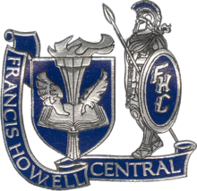

# Activities was I Involved in During High school.

---
Throughout High school, I was involved with a lot. These are groups/organizations as well as sports. Overall These afterschool activities helped with time management and understanding leadership roles as well as much more.

---
### Activities  
* Basketball
  * Played all four years
  * Captain of the team all four years
* Track and Field 
  * Played all four years
  * Captain of the team all four years
* DECA
  * Joined as a Junior
  * Learned a lot about the business field 
* MAC Scholars
  * A part of the leadership council
  * Was started to help minorities of the school with success in and outside the classrooms
* NHS 
  * Joined my sophomore year due to my academic success.
* Sportsmanship Leadership Council
  * Group of student to represent the school in sports activities, to show sportsmanship with other teams

[Home](./README.md)
